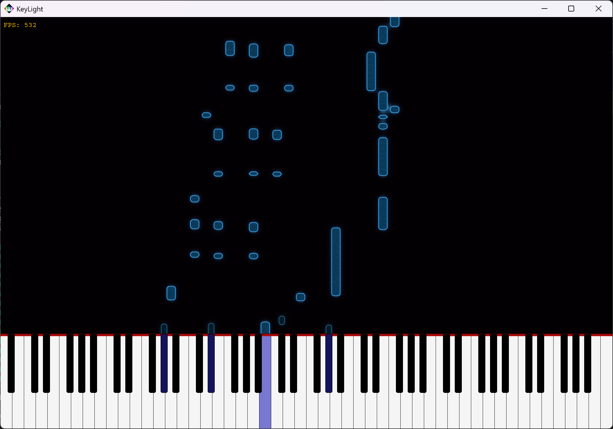

#  KeyLight

#### A modern alternative to tools like *Embers* and *SeeMusic*

**KeyLight** is a free and open-source MIDI piano visualizer designed to create stunning falling-note animations on a virtual keyboard. It offers seamless synchronization between MIDI input and MP3 audio, making it ideal for creating expressive music renderings and performance videos.



## <u>Dependencies</u>

##### OmniaFramework

KeyLight depends on [**OmniaFramework**](https://github.com/OmniaX-dev/OmniaFramework), a modular C++ utility library developed alongside this project.

> On **Windows** (**MSYS2**) ensure the **ostd.dll** file is placed inside the `bin/` directory of your MSYS2 `ucrt64/` environment, and the `inckude/ostd/` directory is placed into `include/` directory of the MSYS2 `ucrt64/` environment.

##### TGUI

KeyLight uses [**TGUI**](https://tgui.eu/), a modern C++ GUI library built on SFML.

> On **Windows** (**MSYS2**), this library muhst be built manually from source (instructions are in the **Windows** section).

##### SFML3

KeyLight relies on [**SFML 3**](https://www.sfml-dev.org/) for rendering, audio playback, and input handling.

> On **Windows** (**MSYS2**), this library muhst be built manually from source (instructions are in the **Windows** section).

##### midifile (included)

KeyLight uses the [**midifile**](https://github.com/craigsapp/midifile) library by Craig Stuart Sapp for MIDI parsing and manipulation.

> This library is **included directly** in the project source tree, so no separate installation is required, the library is compiled as part of KeyLight.

### <u>Build instructions - Windows</u>

##### Step 1: Install MSYS2

Download and install [**MSYS2**](https://www.msys2.org/), a minimal Unix-like environment for Windows that includes Clang, Make, and package management.

> ⚠️ **Recommended install path:**
> Leave the default location `C:\msys64` unchanged.
> If you install MSYS2 elsewhere, you may need to manually adjust paths in scripts and build commands throughout the build process.

Once installed, launch the **MSYS2 UCRT64 terminal**; this is the environment KeyLight is designed to build in.

##### Step 2: Prepare build environment

Once you have the **MSYS2 UCRT64 terminal** open, run theese two commands to prepare the build environment:

```bash
pacman -Syuu
pacman -S --needed base-devel mingw-w64-ucrt-x86_64-clang mingw-w64-ucrt-x86_64-gdb mingw-w64-ucrt-x86_64-cmake mingw-w64-ucrt-x86_64-make mingw-w64-ucrt-x86_64-boost
```

##### Step 3: build SFML3 from source

Still in the **UCRT64** terminal, run the following commands to download, compile and install **SFML3** into your environment:

```bash
pacman -S --needed git cmake ninja mingw-w64-ucrt-x86_64-gcc mingw-w64-ucrt-x86_64-libvorbis mingw-w64-ucrt-x86_64-flac mingw-w64-ucrt-x86_64-libogg mingw-w64-ucrt-x86_64-openal mingw-w64-ucrt-x86_64-freetype mingw-w64-ucrt-x86_64-libjpeg-turbo
mkdir keylight_dev && cd keylight_dev
git clone --branch 3.0.1 https://github.com/SFML/SFML.git sfml3
cd sfml3
cmake -S . -B build-shared -G Ninja \
    -DCMAKE_BUILD_TYPE=Release \
    -DCMAKE_INSTALL_PREFIX=/ucrt64 \
    -DCMAKE_C_COMPILER=/ucrt64/bin/gcc.exe \
    -DCMAKE_CXX_COMPILER=/ucrt64/bin/g++.exe \
    -DBUILD_SHARED_LIBS=ON
cmake --build build-shared
cmake --install build-shared
cd ..
```

#### Step 4: build TGUI from source

In the **UCRT64** terminal, run the following commands to download, compile and install **TGUI** into your environment:

```bash
git clone https://github.com/texus/TGUI.git
cd TGUI
mkdir build && cd build
cmake .. -G "Unix Makefiles" -DCMAKE_BUILD_TYPE=Release -DTGUI_BACKEND=SFML_GRAPHICS -DCMAKE_INSTALL_PREFIX=/ucrt64
make -j$(nproc)
make install
cd ..
```

#### Step 5: build KeyLight

Finally, still in the UCRT64 terminal, run the following commands to download and compile KeyLight:

```bash
git clone https://github.com/OmniaX-dev/KeyLight.git
cd KeyLight
./build release
```

##### Build options

Once **MSYS2** is installed and your environment is set up, you can use the `./build` script to compile KeyLight in various modes other than release:

###### <u>Debug build</u>

```bash
./build debug
```

Compiles KeyLight with debug symbols and no optimization, ideal for development and troubleshooting.

###### <u>Incremental build (uses last configuration)</u>

```bash
 ./build
```

Rebuilds only the modified source files using **whichever build configuration was last used** (`debug` or `release`).
This is ideal for fast iteration without switching modes.

###### <u>Run after build</u>

```bash
./build run
```

Same as `./build`, but immediately launches the application after building the changes.

###### <u>Windows release packaging</u>

```bash
./build windows_release
```

Creates a full Windows release in `bin/KeyLight_w64/`, including:

- The compiled executable
- All required DLLs
- Assets and resources
- License files

> ⚠️ **Important:**
> This script assumes MSYS2 is installed at `C:/msys64`.
> If your installation is in a different location, you must manually update the `MSYS_ROOT` variable at the top of `other/build_windows_release.sh`.

### <u>Build instructions - Linux</u>

TODO
